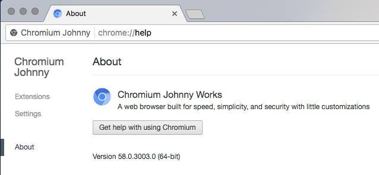

# Chromium Johnny Works
A web browser built for speed, simplicity, and security with little customizations

This repository contains patches that I've made to make Chromium more personal or do some funny experiments.

## List of changes
* Brand customizations to make aware that it's a modified Chromium
* Removed Back/Forward and Reload page buttons _(not ported on Windows/Linux)_
